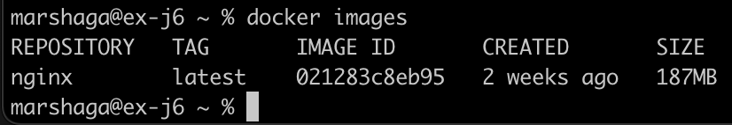
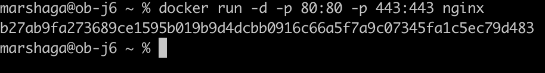

## Contents
1. [Part 1](#part-1-готовый-докер)
2. [Part 2](#part-2-операции-с-контейнером)


## Part 1. Готовый докер

```
rm -rf ~/Library/Containers/com.docker.docker
mkdir -p ~/goinfre/Docker/Data
ln -s ~/goinfre/Docker ~/Library/Containers/com.docker.docker
```
### 1.1 Взять официальный докер образ с **nginx** и выкачать его при помощи `docker pull`

```
docker pull nginx
```


Screenshot 1. `docker pull`

### 1.2 Проверить наличие докер образа через `docker images`

```
docker images
```



Screenshot 2. Наличие докер образа

### 1.3 Запустить докер образ через `docker run -d [image_id|repository]`
```
docker run -d nginx
```


Screenshot 3. Запуск докера

### 1.4 Проверить, что образ запустился через `docker ps`

```
docker ps
```


Screenshot 4. Проверка состояния

### 1.5 Посмотреть информацию о контейнере через `docker inspect [container_id|container_name]`

```
docker inspect c8372aa5156b
```


Screenshot 5. Информация о кон  тейнере с id c8372aa5156b

### 1.6 По выводу команды определить и поместить в отчёт размер контейнера, список замапленных портов и ip контейнера

Размер контейнера: 67108864
Список замапленных портов: "80/tcp": {}
IP контейнера: 172.17.0.2

### 1.7 Остановить докер образ через `docker stop [container_id|container_name]`
```
docker stop c8372aa5156b
```


Screenshot 6. Остановка докера

### 1.8 Проверить, что образ остановился через `docker ps`
```
docker ps
```


Screenshot 7. Запущенного образа нет

### 1.9 Запустить докер с портами 80 и 443 в контейнере, замапленными на такие же порты на локальной машине, через команду *run*
```
docker run -d -p 80:80 -p 443:443 nginx
```


Screenshot 8. Запущенный докер

### 1.10 Проверить, что в браузере по адресу *localhost:80* доступна стартовая страница **nginx**

```
localhost:80
```


Screenshot 9. Стартовая страница доступна

### 1.11 Перезапустить докер контейнер через `docker restart [container_id|container_name]`
```
docker restart b27ab9fa2736
```


Screenshot 10. Перезапуск докера

### 1.12 Проверить любым способом, что контейнер запустился
```
docker ps
```


Screenshot 11. Докер запущен


## Part 2. Операции с контейнером

### Прочитать конфигурационный файл *nginx.conf* внутри докер контейнера через команду *exec*

```
docker exec hopeful_kirch cat /etc/nginx/nginx.conf
```


Screenshot 12. Открываем файл

### Создать на локальной машине файл *nginx.conf*

```
touch nginx.conf
```


Screenshot 13. Создание файла

### Настроить в нем по пути */status* отдачу страницы статуса сервера **nginx**

```
  server {
        location /status {
                        stub_status on;
                        }
    }
```


Screenshot 14. Создание отдачи страницы

### Скопировать созданный файл *nginx.conf* внутрь докер образа через команду `docker cp`

```
docker cp nginx.conf hopeful_kirch:/etc/nginx/nginx.conf
```


Screenshot 15. Копирование

### Перезапустить **nginx** внутри докер образа через команду *exec*

```
docker exec hopeful_kirch nginx -s reload
```


Screenshot 15. Перезапуск

### Проверить, что по адресу *localhost:80/status* отдается страничка со статусом сервера **nginx**

```
localhost:80/status
```


Screenshot 16. Отображение страницы со статусом сервера

### Экспортировать контейнер в файл *container.tar* через команду *export*

```
docker export hopeful_kirch > container.tar
```


Screenshot 17. Done

### Остановить контейнер

```
docker stop hopeful_kirch
```


Screenshot 18. Stop

### Удалить образ через `docker rmi [image_id|repository]`, не удаляя перед этим контейнеры

```
docker rmi -f eea7b3dcba7e
```


Screenshot 19.

### Удалить остановленный контейнер

```
docker rm 0c1dfc764451
```


Screenshot 20.

### Импортировать контейнер обратно через команду *import*

```
docker import -c 'CMD ["nginx", "-g", "daemon off;"]' container.tar src:version_1
```


Screenshot 21.

### Запустить импортированный контейнер

```
docker run -p 80:80 -d --name marshaga_container src:version_1
```


Screenshot 22.

### Проверить, что по адресу *localhost:80/status* отдается страничка со статусом сервера **nginx**

```
localhost:80/status
```


Screenshot 23.